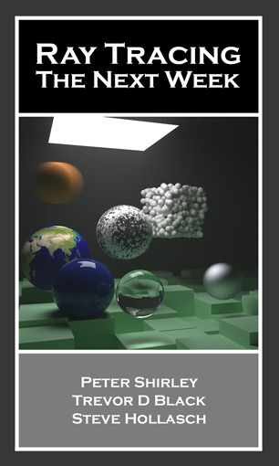
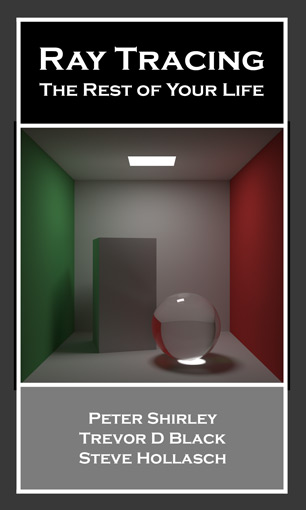

# rt-books

A Rust implementation of the well-known [Ray Tracing in One Weekend](https://raytracing.github.io/) book series.

📖 **Read the first book online:** [**Ray Tracing in One Weekend**](https://goldnor.github.io/rt-in-one-weekend/)

|  |  |  |
|:--:|:--:|:--:|
| **[Ray Tracing in One Weekend](https://goldnor.github.io/rt-in-one-weekend/)** | *Coming Soon* | *Coming Soon* |

## 📄 PDF Downloads

You can download the first book as a PDF from the [v4.0.2 release](https://github.com/goldnor/rt-in-one-weekend/releases/tag/v4.0.2).

## 🧪 Code

Only the first book is currently implemented.  
The source code is available in the [**code** repository](https://github.com/goldnor/code).
