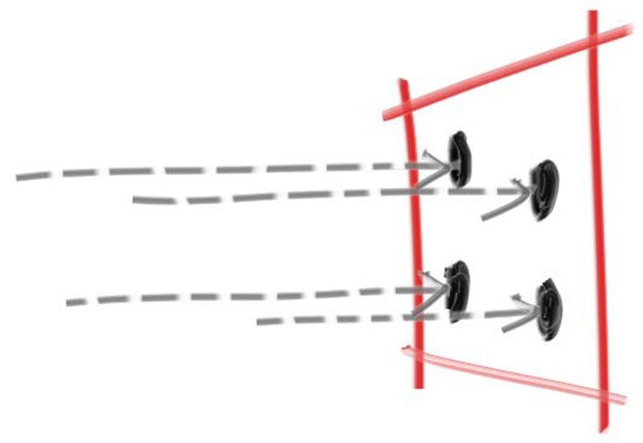

# Antialiasing

If you zoom into the rendered images so far, you might notice the harsh “stair step” nature of edges in our rendered images. This stair-stepping is commonly referred to as “aliasing”, or “jaggies”. When a real camera takes a picture, there are usually no jaggies along edges, because the edge pixels are a blend of some foreground and some background. Consider that unlike our rendered images, a true image of the world is continuous. Put another way, the world (and any true image of it) has effectively infinite resolution. We can get the same effect by averaging a bunch of samples for each pixel.

With a single ray through the center of each pixel, we are performing what is commonly called *point sampling*. The problem with point sampling can be illustrated by rendering a small checkerboard far away. If this checkerboard consists of an 8×8 grid of black and white tiles, but only four rays hit it, then all four rays might intersect only white tiles, or only black, or some odd combination. In the real world, when we perceive a checkerboard far away with our eyes, we perceive it as a gray color, instead of sharp points of black and white. That's because our eyes are naturally doing what we want our ray tracer to do: integrate the (continuous function of) light falling on a particular (discrete) region of our rendered image.

Clearly we don't gain anything by just resampling the same ray through the pixel center multiple times — we'd just get the same result each time. Instead, we want to sample the light falling *around* the pixel, and then integrate those samples to approximate the true continuous result. So, how do we integrate the light falling around the pixel?

We'll adopt the simplest model: sampling the square region centered at the pixel that extends halfway to each of the four neighboring pixels. This is not the optimal approach, but it is the most straight-forward. (See [A Pixel is Not a Little Square](https://www.researchgate.net/publication/244986797_A_Pixel_Is_Not_A_Little_Square_A_Pixel_Is_Not_A_Little_Square_A_Pixel_Is_Not_A_Little_Square) for a deeper dive into this topic.)

**Figure 8:** *Pixel samples*

 
