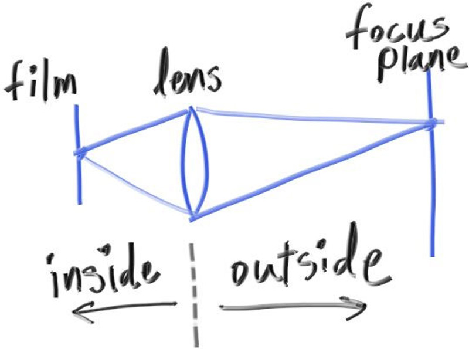

## A Thin Lens Approximation

A real camera has a complicated compound lens. For our code, we could simulate the order: sensor, then lens, then aperture. Then we could figure out where to send the rays, and flip the image after it's computed (the image is projected upside down on the film). Graphics people, however, usually use a thin lens approximation:

**Figure 21:** *Camera lens model*

 

We don’t need to simulate any of the inside of the camera — for the purposes of rendering an image outside the camera, that would be unnecessary complexity. Instead, I usually start rays from an infinitely thin circular “lens”, and send them toward the pixel of interest on the focus plane (`focal_length` away from the lens), where everything on that plane in the 3D world is in perfect focus.

In practice, we accomplish this by placing the viewport in this plane. Putting everything together:

1. The focus plane is orthogonal to the camera view direction.
2. The focus distance is the distance between the camera center and the focus plane.
3. The viewport lies on the focus plane, centered on the camera view direction vector.
4. The grid of pixel locations lies inside the viewport (located in the 3D world).
5. Random image sample locations are chosen from the region around the current pixel location.
6. The camera fires rays from random points on the lens through the current image sample location.

**Figure 22:** *Camera focus plane*

 
