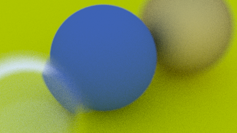

## Generating Sample Rays

Without defocus blur, all scene rays originate from the camera center (or `lookfrom`). In order to accomplish defocus blur, we construct a disk centered at the camera center. The larger the radius, the greater the defocus blur. You can think of our original camera as having a defocus disk of radius zero (no blur at all), so all rays originated at the disk center (`lookfrom`).

So, how large should the defocus disk be? Since the size of this disk controls how much defocus blur we get, that should be a parameter of the camera class. We could just take the radius of the disk as a camera parameter, but the blur would vary depending on the projection distance. A slightly easier parameter is to specify the angle of the cone with apex at viewport center and base (defocus disk) at the camera center. This should give you more consistent results as you vary the focus distance for a given shot.

Since we'll be choosing random points from the defocus disk, we'll need a function to do that: `random_in_unit_disk()`. This function works using the same kind of method we use in `random_unit_vector()`, just for two dimensions.

```rust-diff,norun,noplayground
{{ #git diff -U999 -h f9b02376bc5c4d4f7337d6fef6903506086925da 8f64151623f1e58e249d00f11a8cac23523fec1b src/vec3.rs:176: }}
```

<!-- NOTE: This commit is the latest, however the feature was impelemted earlier which is why we show an older diff  -->
**Listing 85:** [[vec3.rs](https://github.com/goldnor/code/blob/409a0091e1b14c4a64af91b19dc405ab78f32862/src/vec3.rs)] *Generate random point inside unit disk*

<br>

Now let's update the camera to originate rays from the defocus disk:

```rust-diff,norun,noplayground
{{ #git diff -U999 409a0091e1b14c4a64af91b19dc405ab78f32862 e38cd9da49c32555a48301a9d263c48356ba3baa src/camera.rs:[7:82,129:142,165:179,180:199,200:210,212:220,221:232,239,243:253,264,268:] }}
```

**Listing 86:** [[camera.rs](https://github.com/goldnor/code/blob/e38cd9da49c32555a48301a9d263c48356ba3baa/src/camera.rs)] *Camera with adjustable depth-of-field*

<br>

Using a large aperture:

```rust-diff,norun,noplayground
{{ #git diff -U999 -h e38cd9da49c32555a48301a9d263c48356ba3baa f6173c36dab520541cdac68d8f9c40c24ca7b606 src/main.rs:[13,49:] }}
```

**Listing 87:** [[main.rs](https://github.com/goldnor/code/blob/f6173c36dab520541cdac68d8f9c40c24ca7b606/src/main.rs)] *Scene camera with depth-of-field*

<br>

We get:



**Image 22:** *Spheres with depth-of-field*

<br>
