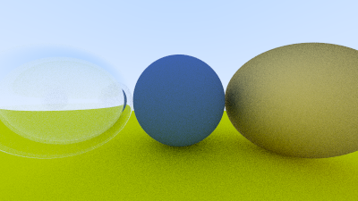

## Modeling a Hollow Glass Sphere

Let's model a hollow glass sphere. This is a sphere of some thickness with another sphere of air inside it. If you think about the path of a ray going through such an object, it will hit the outer sphere, refract, hit the inner sphere (assuming we do hit it), refract a second time, and travel through the air inside. Then it will continue on, hit the inside surface of the inner sphere, refract back, then hit the inside surface of the outer sphere, and finally refract and exit back into the scene atmosphere.

The outer sphere is just modeled with a standard glass sphere, with a refractive index of around 1.50 (modeling a refraction from the outside air into glass). The inner sphere is a bit different because *its* refractive index should be relative to the material of the surrounding outer sphere, thus modeling a transition from glass into the inner air.

This is actually simple to specify, as the `refraction_index` parameter to the dielectric material can be interpreted as the *ratio* of the refractive index of the object divided by the refractive index of the enclosing medium. In this case, the inner sphere would have an refractive index of air (the inner sphere material) over the index of refraction of glass (the enclosing medium), or \\( 1.00/1.50=0.67 \\).

Here's the code:

```rust-diff,norun,noplayground
{{ #git diff -U999 -h bdb3324e3e3a832a0aa528a60ecffb1a2b5eb862 3d2dfe52b90bf3d6bc1287c0b5bcbbbb998b1d47 src/main.rs:15:49 }}
```

**Listing 79:** [[main.rs](https://github.com/goldnor/code/blob/3d2dfe52b90bf3d6bc1287c0b5bcbbbb998b1d47/src/main.rs)] *Scene with hollow glass sphere*

<br>

And here's the result:



**Image 18:** *A hollow glass sphere*

<br>

