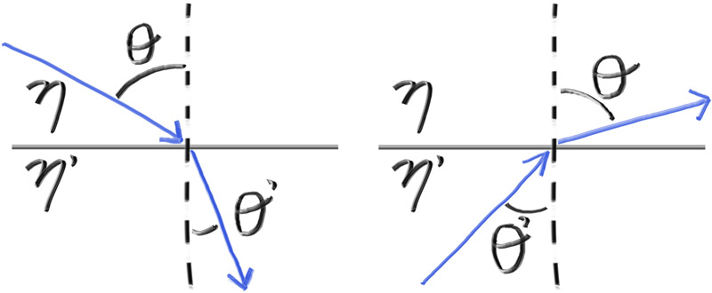
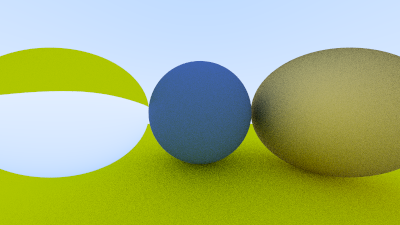

## Snell's Law

The refraction is described by Snell’s law:

\\[ \eta \cdot \sin \theta = \eta' \cdot \sin \theta'  \\]

Where \\( \theta \\) and \\( \theta' \\) are the angles from the normal, and \\( \eta \\) and \\( \eta' \\) (pronounced “eta” and “eta prime”) are the refractive indices. The geometry is:



**Figure 17:** *Ray refraction*

<br>

In order to determine the direction of the refracted ray, we have to solve for \\( \sin \theta' \\):

\\[ \sin \theta' = \frac{\eta}{\eta'} \cdot \sin \theta \\]

On the refracted side of the surface there is a refracted ray \\( \mathbf{R}' \\) and a normal \\( \mathbf{n}' \\), and there exists an angle, \\( \theta' \\), between them. We can split \\( \mathbf{R}' \\) into the parts of the ray that are perpendicular to \\( \mathbf{n}' \\) and parallel to \\( \mathbf{n}' \\):

\\[ \mathbf{R}' = \mathbf{R}' _ {\\bot}  + \mathbf{R}'_{\\|} \\]

If we solve for \\( \mathbf{R}' _ {\\bot} \\)  and \\( \mathbf{R}'_{\\|} \\) we get:

\\[ \mathbf{R}' _ {\\bot} = \frac{\eta}{\eta'} (\mathbf{R} + |\mathbf{R}| \cos( \theta ) \mathbf{n} )  \\]

\\[ \mathbf{R}'_{\\|} = - \sqrt{1 - |\mathbf{R}' _ {\\bot}|^2 } \mathbf{n} \\]

You can go ahead and prove this for yourself if you want, but we will treat it as fact and move on. The rest of the book will not require you to understand the proof.

We know the value of every term on the right-hand side except for \\( \cos \theta \\). It is well known that the dot product of two vectors can be explained in terms of the cosine of the angle between them:

\\[ \mathbf{𝐚} \cdot \mathbf{b} = |\mathbf{a}| |\mathbf{b}| \cos \theta \\]

If we restrict \\( \mathbf{a} \\) and \\( \mathbf{b} \\) to be unit vectors:

\\[ \mathbf{𝐚} \cdot \mathbf{b} = \cos \theta \\]

We can now rewrite \\( \mathbf{R}' _ {\\bot} \\) in terms of known quantities:

\\[ \mathbf{R}' _ {\\bot} = \frac{\eta}{\eta'} (\mathbf{R} + (- \mathbf{R} \cdot \mathbf{n} ) \mathbf{n} )  \\]

When we combine them back together, we can write a function to calculate \\( \mathbf{R}' \\):

```rust-diff,norun,noplayground
{{ #git diff -U999 -h 1546be13df8bf1a655398e2b6b27045d63281290 e8bbb4e688c7e3a8b3fc4f20c650cf43c5b9f71c src/vec3.rs:220:234 }}
```

**Listing 71:** [[vec3.rs](https://github.com/goldnor/code/blob/e8bbb4e688c7e3a8b3fc4f20c650cf43c5b9f71c/src/vec3.rs)] *Refraction function*

<br>

And the dielectric material that always refracts is:

```rust-diff,norun,noplayground
{{ #git diff -U999 -h e8bbb4e688c7e3a8b3fc4f20c650cf43c5b9f71c 90798de9cb5e9f59ce5222972c0cb5b2390ce1f4 src/material.rs:[53,59,62:] }}
```

**Listing 72:** [[material.rs](https://github.com/goldnor/code/blob/90798de9cb5e9f59ce5222972c0cb5b2390ce1f4/src/material.rs)] *Dielectric material class that always refracts*

<br>

Now we'll update the scene to illustrate refraction by changing the left sphere to glass, which has an index of refraction of approximately 1.5.

```rust-diff,norun,noplayground
{{ #git diff -U999 -h 90798de9cb5e9f59ce5222972c0cb5b2390ce1f4 e7d30179cee4fc7242cc3a887dc6d7a7eb6b86f0 src/main.rs:17:22 }}
```

**Listing 73:** [[main.rs](https://github.com/goldnor/code/blob/e7d30179cee4fc7242cc3a887dc6d7a7eb6b86f0&src/main.rs)] *Changing the left sphere to glass*

<br>

This gives us the following result:



**Image 16:** *Glass sphere that always refracts*

<br>


