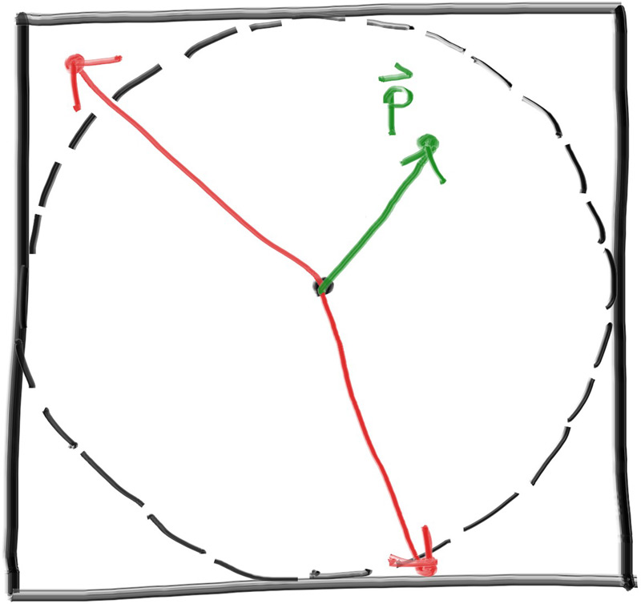
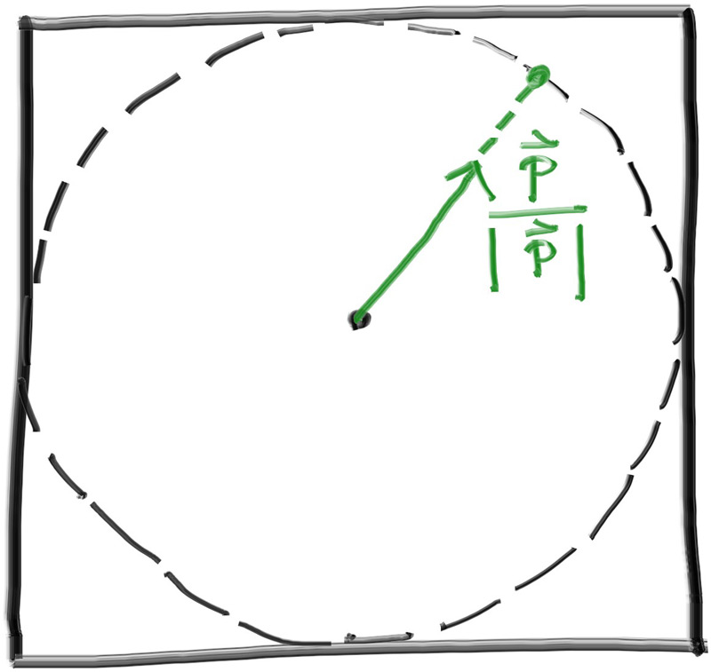
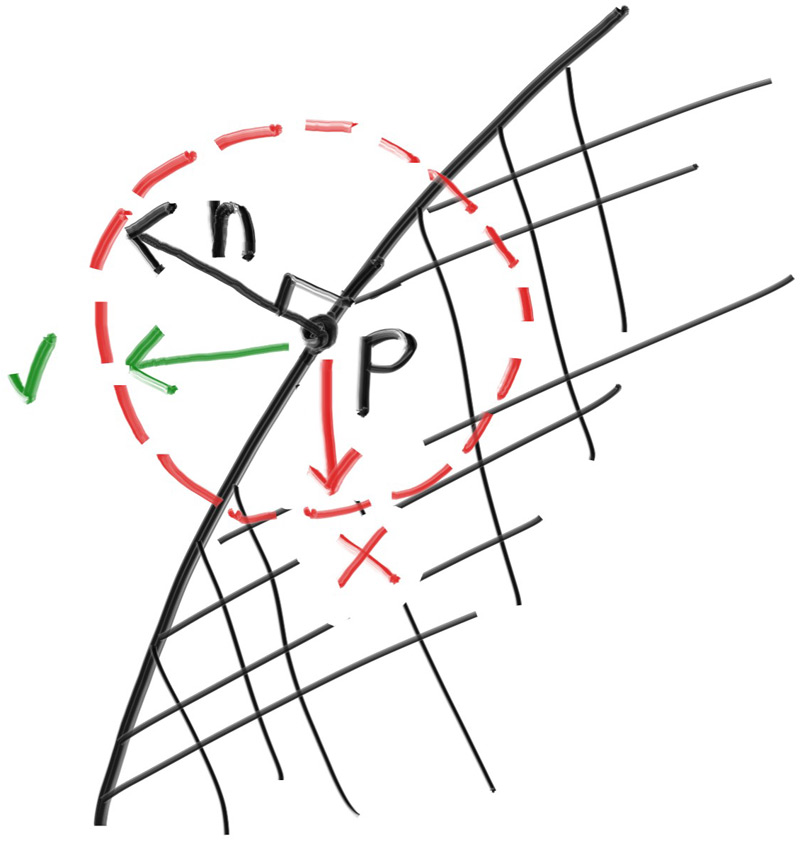
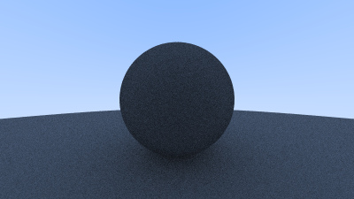

## A Simple Diffuse Material

Diffuse objects that don’t emit their own light merely take on the color of their surroundings, but they do modulate that with their own intrinsic color. Light that reflects off a diffuse surface has its direction randomized, so, if we send three rays into a crack between two diffuse surfaces they will each have different random behavior:


**Figure 9:** *Light ray bounces*

<br>

They might also be absorbed rather than reflected. The darker the surface, the more likely the ray is absorbed (that’s why it's dark!). Really any algorithm that randomizes direction will produce surfaces that look matte. Let's start with the most intuitive: a surface that randomly bounces a ray equally in all directions. For this material, a ray that hits the surface has an equal probability of bouncing in any direction away from the surface.


**Figure 10:** *Equal reflection above the horizon*

<br>

This very intuitive material is the simplest kind of diffuse and — indeed — many of the first raytracing papers used this diffuse method (before adopting a more accurate method that we'll be implementing a little bit later). We don't currently have a way to randomly reflect a ray, so we'll need to add a few functions to our vector utility header. The first thing we need is the ability to generate arbitrary random vectors:

```rust-diff,norun,noplayground
{{ #git diff -U999 -h d4b3a2498a7ed1a3a51ade2c425683a7ff4ad018 e486826f6cf6e4b50e5ac2f23f9797ae39c3f99d src/vec3.rs:[17,41:55] }}
```

**Listing 47:** [[vec3.rs](https://github.com/goldnor/code/blob/e486826f6cf6e4b50e5ac2f23f9797ae39c3f99d/src/vec3.rs)] *vec3 random utility functions*

<br>

Then we need to figure out how to manipulate a random vector so that we only get results that are on the surface of a hemisphere. There are analytical methods of doing this, but they are actually surprisingly complicated to understand, and quite a bit complicated to implement. Instead, we'll use what is typically the easiest algorithm: A rejection method. A rejection method works by repeatedly generating random samples until we produce a sample that meets the desired criteria. In other words, keep rejecting bad samples until you find a good one.

There are many equally valid ways of generating a random vector on a hemisphere using the rejection method, but for our purposes we will go with the simplest, which is:

1. Generate a random vector inside the unit sphere
2. Normalize this vector to extend it to the sphere surface
3. Invert the normalized vector if it falls onto the wrong hemisphere

First, we will use a rejection method to generate the random vector inside the unit sphere (that is, a sphere of radius \\( 1 \\)). Pick a random point inside the cube enclosing the unit sphere (that is, where \\( 𝑥 \\), \\( 𝑦 \\), and \\( 𝑧 \\) are all in the range \\( [−1,+1] \\)). If this point lies outside the unit sphere, then generate a new one until we find one that lies inside or on the unit sphere.



**Figure 11:** *Two vectors were rejected before finding a good one (pre-normalization)*

<br>



**Figure 12:** *The accepted random vector is normalized to produce a unit vector*

<br>

Here's our first draft of the function:

```rust-diff,norun,noplayground
{{ #git diff -U999 -h e486826f6cf6e4b50e5ac2f23f9797ae39c3f99d 7f3d292868eea2acfcbcc87b7fb42341c59c55e1 src/vec3.rs:194:204 }}
```

**Listing 48:** [[vec3.rs](https://github.com/goldnor/code/blob/7f3d292868eea2acfcbcc87b7fb42341c59c55e1/src/vec3.rs)] *The random_unit_vector() function, version one*

<br>

Sadly, we have a small floating-point abstraction leak to deal with. Since floating-point numbers have finite precision, a very small value can underflow to zero when squared. So if all three coordinates are small enough (that is, very near the center of the sphere), the norm of the vector will be zero, and thus normalizing will yield the bogus vector \\( [\pm \infty, \pm \infty, \pm \infty] \\). To fix this, we'll also reject points that lie inside this “black hole” around the center. With double precision (64-bit floats), we can safely support values greater than 10−160.

Here's our more robust function:

```rust-diff,norun,noplayground
{{ #git diff -U999 -h 7f3d292868eea2acfcbcc87b7fb42341c59c55e1 ad94c6aff825a9cf5c9a0983bfefc7a5e3900725 src/vec3.rs:194:205 }}
```

**Listing 49:** [[vec3.rs](https://github.com/goldnor/code/blob/ad94c6aff825a9cf5c9a0983bfefc7a5e3900725/src/vec3.rs)] *The random_unit_vector() function, version two*

<br>

Now that we have a random unit vector, we can determine if it is on the correct hemisphere by comparing against the surface normal:



**Figure 13:** *The normal vector tells us which hemisphere we need*

<br>

We can take the dot product of the surface normal and our random vector to determine if it's in the correct hemisphere. If the dot product is positive, then the vector is in the correct hemisphere. If the dot product is negative, then we need to invert the vector.

```rust-diff,norun,noplayground
{{ #git diff -U999 -h ad94c6aff825a9cf5c9a0983bfefc7a5e3900725 ed6876bfb6d8535e8c38b088f219963a12040a42 src/vec3.rs:205:214 }}
```

**Listing 50:** [[vec3.rs](https://github.com/goldnor/code/blob/ed6876bfb6d8535e8c38b088f219963a12040a42/src/vec3.rs)] *The random_on_hemisphere() function*

<br>

If a ray bounces off of a material and keeps 100% of its color, then we say that the material is *white*. If a ray bounces off of a material and keeps 0% of its color, then we say that the material is black. As a first demonstration of our new diffuse material we'll set the `ray_color` function to return 50% of the color from a bounce. We should expect to get a nice gray color.

```rust-diff,norun,noplayground
{{ #git diff -U999 -h ed6876bfb6d8535e8c38b088f219963a12040a42 6add135dade4bf646ea0543faade188411b1df81 src/camera.rs:[45,145:] }}
```

**Listing 51:** [[camera.rs](https://github.com/goldnor/code/blob/6add135dade4bf646ea0543faade188411b1df81/src/camera.rs)] *ray_color() using a random ray direction*

<br>

... Indeed we do get rather nice gray spheres:



**Image 7:** *First render of a diffuse sphere*

<br>
