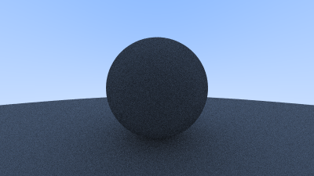

## Limiting the Number of Child Rays

There's one potential problem lurking here. Notice that the `ray_color` function is recursive. When will it stop recursing? When it fails to hit anything. In some cases, however, that may be a long time — long enough to blow the stack. To guard against that, let's limit the maximum recursion depth, returning no light contribution at the maximum depth:

```rust-diff,norun,noplayground
{{ #git diff -U999 -h 6add135dade4bf646ea0543faade188411b1df81 36edc44f5198d8ed04f5b50641cccd792f435f26 src/camera.rs:[7:49,66:96,155:] }}
```

**Listing 52:** [[camera.rs](https://github.com/goldnor/code/blob/36edc44f5198d8ed04f5b50641cccd792f435f26/src/camera.rs)] *camera::ray_color() with depth limiting*

<br>

Update the main() function to use this new depth limit:

```rust-diff,norun,noplayground
{{ #git diff -U999 -h 36edc44f5198d8ed04f5b50641cccd792f435f26 7be08e72109304cab1df8c2d9d6a9a17fe9a936b src/main.rs:[7,14:] }}
```

**Listing 53:** [[main.rs](https://github.com/goldnor/code/blob/7be08e72109304cab1df8c2d9d6a9a17fe9a936b/src/main.rs)] *Using the new ray depth limiting*

<br>

For this very simple scene we should get basically the same result:



**Image 8:** *Second render of a diffuse sphere with limited bounces*

<br>


