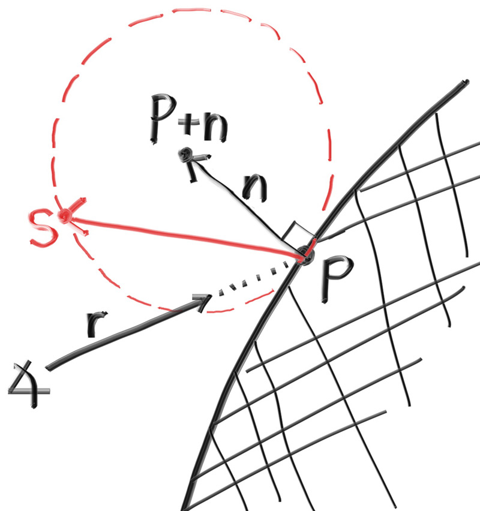

## True Lambertian Reflection

Scattering reflected rays evenly about the hemisphere produces a nice soft diffuse model, but we can definitely do better. A more accurate representation of real diffuse objects is the *Lambertian* distribution. This distribution scatters reflected rays in a manner that is proportional to \\( cos(\phi) \\), where \\( \phi \\) is the angle between the reflected ray and the surface normal. This means that a reflected ray is most likely to scatter in a direction near the surface normal, and less likely to scatter in directions away from the normal. This non-uniform Lambertian distribution does a better job of modeling material reflection in the real world than our previous uniform scattering.

We can create this distribution by adding a random unit vector to the normal vector. At the point of intersection on a surface there is the hit point, \\( \mathbf{p} \\), and there is the normal of the surface, \\( \mathbf{n} \\). At the point of intersection, this surface has exactly two sides, so there can only be two unique unit spheres tangent to any intersection point (one unique sphere for each side of the surface). These two unit spheres will be displaced from the surface by the length of their radius, which is exactly one for a unit sphere.

One sphere will be displaced in the direction of the surface's normal (\\( \mathbf{n} \\)) and one sphere will be displaced in the opposite direction (\\( -\mathbf{n} \\)). This leaves us with two spheres of unit size that will only be just touching the surface at the intersection point. From this, one of the spheres will have its center at \\( (\mathbf{P} + \mathbf{n}) \\) and the other sphere will have its center at \\( (\mathbf{P} - \mathbf{n}) \\). The sphere with a center at \\( (\mathbf{P} - \mathbf{n}) \\) is considered inside the surface, whereas the sphere with center \\( (\mathbf{P} + \mathbf{n}) \\) is considered outside the surface.

We want to select the tangent unit sphere that is on the same side of the surface as the ray origin. Pick a random point \\( \mathbf{S} \\) on this unit radius sphere and send a ray from the hit point \\( \mathbf{P} \\) to the random point \\( \mathbf{S} \\) (this is the vector \\( (\mathbf{S} - \mathbf{P}) \\):



**Figure 14:** *Randomly generating a vector according to Lambertian distribution*

<br>

The change is actually fairly minimal:

```rust-diff,norun,noplayground
{{ #git diff -U999 -h f4051c25e9322b269695ab51a919c084a0caa440 2b7ff0c812b41279018742c656ee5fa894bf50c3 src/camera.rs:[48,154:] }}
```

**Listing 55:** [[camera.rs](https://github.com/goldnor/code/blob/2b7ff0c812b41279018742c656ee5fa894bf50c3/src/camera.rs)] *ray_color() with replacement diffuse*

<br>

After rendering we get a similar image:


**Image 10:** *Correct rendering of Lambertian spheres*

<br>

It's hard to tell the difference between these two diffuse methods, given that our scene of two spheres is so simple, but you should be able to notice two important visual differences:

1. The shadows are more pronounced after the change
2. Both spheres are tinted blue from the sky after the change

Both of these changes are due to the less uniform scattering of the light rays—more rays are scattering toward the normal. This means that for diffuse objects, they will appear *darker* because less light bounces toward the camera. For the shadows, more light bounces straight-up, so the area underneath the sphere is darker.

Not a lot of common, everyday objects are perfectly diffuse, so our visual intuition of how these objects behave under light can be poorly formed. As scenes become more complicated over the course of the book, you are encouraged to switch between the different diffuse renderers presented here. Most scenes of interest will contain a large amount of diffuse materials. You can gain valuable insight by understanding the effect of different diffuse methods on the lighting of a scene.
