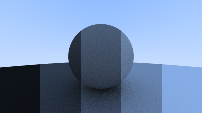

## Using Gamma Correction for Accurate Color Intensity

Note the shadowing under the sphere. The picture is very dark, but our spheres only absorb half the energy of each bounce, so they are 50% reflectors. The spheres should look pretty bright (in real life, a light grey) but they appear to be rather dark. We can see this more clearly if we walk through the full brightness gamut for our diffuse material. We start by setting the reflectance of the `ray_color` function from `0.5` (50%) to `0.1` (10%):

```rust-diff,norun,noplayground
{{ #git diff -U999 -h 2b7ff0c812b41279018742c656ee5fa894bf50c3 b01ae43747d7bcf10be39364d907ab708701d2db src/camera.rs:[48,154:] }}
```

**Listing 56:** [[camera.rs](https://github.com/goldnor/code/blob/b01ae43747d7bcf10be39364d907ab708701d2db/src/camera.rs)] *ray_color() with 10% reflectance*

<br>

We render out at this new 10% reflectance. We then set reflectance to 30% and render again. We repeat for 50%, 70%, and finally 90%. You can overlay these images from left to right in the photo editor of your choice and you should get a very nice visual representation of the increasing brightness of your chosen gamut. This is the one that we've been working with so far:



**Image 11:** *The gamut of our renderer so far*

<br>

f you look closely, or if you use a color picker, you should notice that the 50% reflectance render (the one in the middle) is far too dark to be half-way between white and black (middle-gray). Indeed, the 70% reflector is closer to middle-gray. The reason for this is that almost all computer programs assume that an image is “gamma corrected” before being written into an image file. This means that the 0 to 1 values have some transform applied before being stored as a byte. Images with data that are written without being transformed are said to be in *linear space*, whereas images that are transformed are said to be in *gamma space*. It is likely that the image viewer you are using is expecting an image in gamma space, but we are giving it an image in linear space. This is the reason why our image appears inaccurately dark.

There are many good reasons for why images should be stored in gamma space, but for our purposes we just need to be aware of it. We are going to transform our data into gamma space so that our image viewer can more accurately display our image. As a simple approximation, we can use “gamma 2” as our transform, which is the power that you use when going from gamma space to linear space. We need to go from linear space to gamma space, which means taking the inverse of “gamma 2", which means an exponent of \\( 1/gamma \\), which is just the square-root. We'll also want to ensure that we robustly handle negative inputs.

```rust-diff,norun,noplayground
{{ #git diff -U999 -h b01ae43747d7bcf10be39364d907ab708701d2db 39f58a27fa6c25081163b184082bc7805a2dabcd src/color.rs:9: }}
```
**Listing 57:** [[color.rs](https://github.com/goldnor/code/blob/39f58a27fa6c25081163b184082bc7805a2dabcd/src/color.rs)] *write_color(), with gamma correction*

<br>

Using this gamma correction, we now get a much more consistent ramp from darkness to lightness:


**Image 12:** *The gamut of our renderer, gamma-corrected*

<br>
