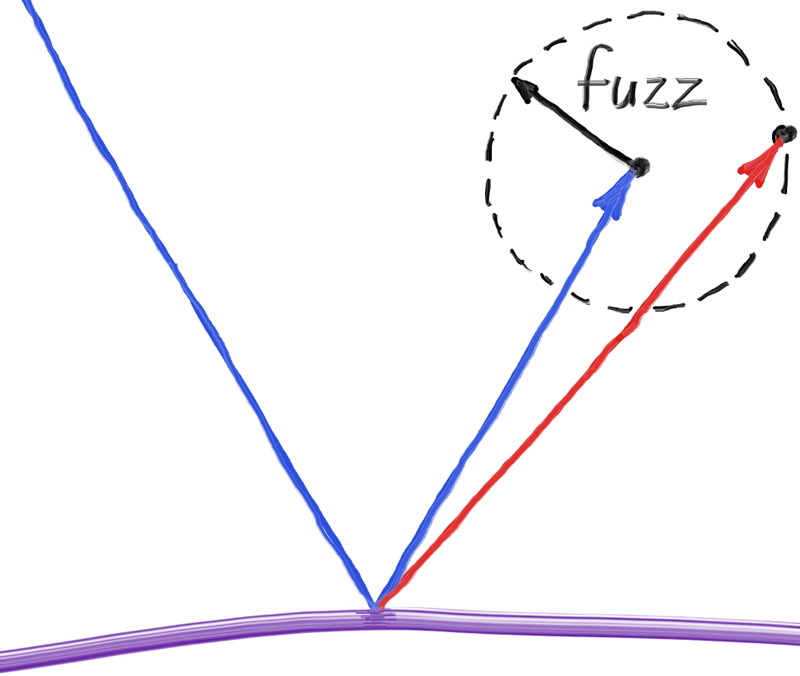

## Fuzzy Reflection

We can also randomize the reflected direction by using a small sphere and choosing a new endpoint for the ray. We'll use a random point from the surface of a sphere centered on the original endpoint, scaled by the fuzz factor.



**Figure 16:** *Generating fuzzed reflection rays*

<br>

The bigger the fuzz sphere, the fuzzier the reflections will be. This suggests adding a fuzziness parameter that is just the radius of the sphere (so zero is no perturbation). The catch is that for big spheres or grazing rays, we may scatter below the surface. We can just have the surface absorb those.

Also note that in order for the fuzz sphere to make sense, it needs to be consistently scaled compared to the reflection vector, which can vary in length arbitrarily. To address this, we need to normalize the reflected ray.

```rust-diff,norun,noplayground
{{ #git diff -U999 -h 29d828944db9e970983d3e7a5b2b3ad827e3991b 1546be13df8bf1a655398e2b6b27045d63281290 src/material.rs:40: }}
```

**Listing 69:** [[material.rs](https://github.com/goldnor/code/blob/1546be13df8bf1a655398e2b6b27045d63281290/src/material.rs)] *Metal material fuzziness*

<br>

We can try that out by adding fuzziness 0.3 and 1.0 to the metals:

```rust-diff,norun,noplayground
{{ #git diff -U999 -h 29d828944db9e970983d3e7a5b2b3ad827e3991b 1546be13df8bf1a655398e2b6b27045d63281290 src/main.rs:[13,15:23,52] }}
```

**Listing 70:** [[main.rs](https://github.com/goldnor/code/blob/1546be13df8bf1a655398e2b6b27045d63281290/src/main.rs)] *Metal spheres with fuzziness*

<br>


**Image 14:** *Fuzzed metal*

<br>
