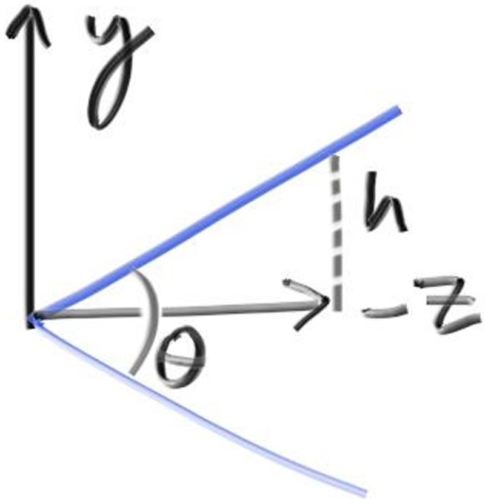

## Camera Viewing Geometry

First, we'll keep the rays coming from the origin and heading to the \\( z = -1\\) plane. We could make it the \\( z = -2 \\) plane, or whatever, as long as we made ℎ a ratio to that distance. Here is our setup:



**Figure 18:** *Camera viewing geometry (from the side)*

<br>

This implies \\( h = \tan (\frac{\theta}{2}) \\). Our camera now becomes:

```rust-diff,norun,noplayground
{{ #git diff -U999 -h 3d2dfe52b90bf3d6bc1287c0b5bcbbbb998b1d47 4927dc70bdac3e6a5f2b3ecf174ee2c4b70a2c65 src/camera.rs:[7:52,75:82,105:138,184] }}
```


**Listing 80:** [[camera.rs](https://github.com/goldnor/code/blob/4927dc70bdac3e6a5f2b3ecf174ee2c4b70a2c65/src/camera.rs)] *Camera with adjustable field-of-view (fov)*

<br>

We'll test out these changes with a simple scene of two touching spheres, using a 90° field of view.

```rust-diff,norun,noplayground
{{ #git diff -U999 -h 4927dc70bdac3e6a5f2b3ecf174ee2c4b70a2c65 52ee7bbdb1a7614b145e3821c1ab91fd010ed7ce src/main.rs:13: }}
```

**Listing 81:** [[main.rs](https://github.com/goldnor/code/blob/52ee7bbdb1a7614b145e3821c1ab91fd010ed7ce/src/main.rs)] *Scene with wide-angle camera*

<br>

This gives us the rendering:


**Image 19:** *A wide-angle view*

<br>
