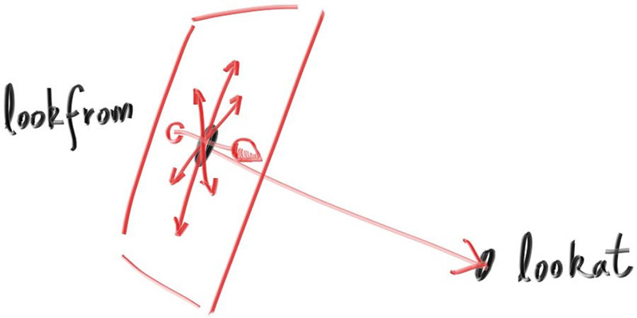

## Positioning and Orienting the Camera

To get an arbitrary viewpoint, let’s first name the points we care about. We’ll call the position where we place the camera *lookfrom*, and the point we look at *lookat*. (Later, if you want, you could define a direction to look in instead of a point to look at.)

We also need a way to specify the roll, or sideways tilt, of the camera: the rotation around the lookat-lookfrom axis. Another way to think about it is that even if you keep `lookfrom` and `lookat` constant, you can still rotate your head around your nose. What we need is a way to specify an “up” vector for the camera.



**Figure 19:** *Camera view direction*

<br>

We can specify any up vector we want, as long as it's not parallel to the view direction. Project this up vector onto the plane orthogonal to the view direction to get a camera-relative up vector. I use the common convention of naming this the “view up” (*vup*) vector. After a few cross products and vector normalizations, we now have a complete orthonormal basis \\( (u, v, w) \\) to describe our camera’s orientation. \\( u \\) will be the unit vector pointing to camera right, \\( v \\) is the unit vector pointing to camera up, \\( w \\) is the unit vector pointing opposite the view direction (since we use right-hand coordinates), and the camera center is at the origin.


**Figure 20:** *Camera view up direction*

<br>

Like before, when our fixed camera faced \\( -Z \\), our arbitrary view camera faces \\( -w \\). Keep in mind that we can — but we don’t have to — use world up \\( (0, 1, 0) \\) to specify vup. This is convenient and will naturally keep your camera horizontally level until you decide to experiment with crazy camera angles.

```rust-diff,norun,noplayground
{{ #git diff -U999 -h 52ee7bbdb1a7614b145e3821c1ab91fd010ed7ce c331ea145b761c687d5ce9fc257aefdbbcf7de51 src/camera.rs:[7:70,99:118,141:183,229] }}
```

**Listing 82:** [[camera.rs](https://github.com/goldnor/code/blob/c331ea145b761c687d5ce9fc257aefdbbcf7de51/src/camera.rs)] *Positionable and orientable camera*

<br>

We'll change back to the prior scene, and use the new viewpoint:

```rust-diff,norun,noplayground
{{ #git diff -U999 -h c331ea145b761c687d5ce9fc257aefdbbcf7de51 c702619b19462b2bff877076a01333fd974613fe src/main.rs:13: }}
```
**Listing 83:** [[main.rs](https://github.com/goldnor/code/blob/c702619b19462b2bff877076a01333fd974613fe/src/main.rs)] *Scene with alternate viewpoint*

<br>

to get:


**Image 20:** *A distant view*

<br>

And we can change field of view:

```rust-diff,norun,noplayground
{{ #git diff -U999 c702619b19462b2bff877076a01333fd974613fe 409a0091e1b14c4a64af91b19dc405ab78f32862 src/main.rs:56 }}
```
**Listing 84:** [[main.rs](https://github.com/goldnor/code/blob/409a0091e1b14c4a64af91b19dc405ab78f32862/src/main.rs)] *Change field of view*

<br>

to get:


**Image 21:** *Zooming in*

<br>


