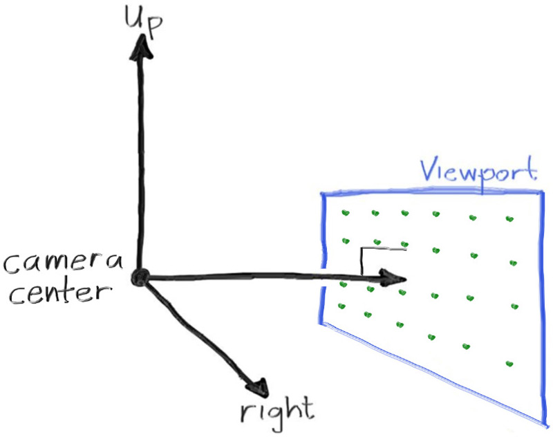

## Sending Rays Into the Scene

Now we are ready to turn the corner and make a ray tracer. At its core, a ray tracer sends rays through pixels and computes the color seen in the direction of those rays. The involved steps are

1. Calculate the ray from the “eye” through the pixel,
2. Determine which objects the ray intersects, and
3. Compute a color for the closest intersection point.

When first developing a ray tracer, I always do a simple camera for getting the code up and running.

I’ve often gotten into trouble using square images for debugging because I transpose 𝑥 and 𝑦 too often, so we’ll use a non-square image. A square image has a 1∶1 aspect ratio, because its width is the same as its height. Since we want a non-square image, we'll choose 16∶9 because it's so common. A 16∶9 aspect ratio means that the ratio of image width to image height is 16∶9. Put another way, given an image with a 16∶9 aspect ratio,

\\[ width\\,/\\,height=16\\,/\\,9=1.7778 \\]

For a practical example, an image 800 pixels wide by 400 pixels high has a 2∶1 aspect ratio.

The image's aspect ratio can be determined from the ratio of its width to its height. However, since we have a given aspect ratio in mind, it's easier to set the image's width and the aspect ratio, and then using this to calculate for its height. This way, we can scale up or down the image by changing the image width, and it won't throw off our desired aspect ratio. We do have to make sure that when we solve for the image height the resulting height is at least 1.

In addition to setting up the pixel dimensions for the rendered image, we also need to set up a virtual *viewport* through which to pass our scene rays. The viewport is a virtual rectangle in the 3D world that contains the grid of image pixel locations. If pixels are spaced the same distance horizontally as they are vertically, the viewport that bounds them will have the same aspect ratio as the rendered image. The distance between two adjacent pixels is called the pixel spacing, and square pixels is the standard.

To start things off, we'll choose an arbitrary viewport height of 2.0, and scale the viewport width to give us the desired aspect ratio. Here's a snippet of what this code will look like:
```rust,norun,noplayground
{{ #git show 62ea1c052209e1e5244078078512771fd6ff712d:src/main.rs:5:17 }}
```

**Listing 8:** *Rendered image setup*

<br>

If you're wondering why we don't just use `aspect_ratio` when computing `viewport_width`, it's because the value set to `aspect_ratio` is the ideal ratio, it may not be the *actual* ratio between `image_width` and `image_height`. If `image_height` was allowed to be real valued—rather than just an integer—then it would be fine to use `aspect_ratio`. But the *actual* ratio between `image_width` and `image_height` can vary based on two parts of the code. First, `image_height` is rounded down to the nearest integer, which can increase the ratio. Second, we don't allow `image_height` to be less than one, which can also change the actual aspect ratio.

Note that `aspect_ratio` is an ideal ratio, which we approximate as best as possible with the integer-based ratio of image width over image height. In order for our viewport proportions to exactly match our image proportions, we use the calculated image aspect ratio to determine our final viewport width.

Next we will define the camera center: a point in 3D space from which all scene rays will originate (this is also commonly referred to as the *eye point*). The vector from the camera center to the viewport center will be orthogonal to the viewport. We'll initially set the distance between the viewport and the camera center point to be one unit. This distance is often referred to as the *focal length*.

For simplicity we'll start with the camera center at \\( (0,0,0) \\). We'll also have the y-axis go up, the x-axis to the right, and the negative z-axis pointing in the viewing direction. (This is commonly referred to as *right-handed coordinates*.)



**Figure 3:** *Camera geometry*

<br>

Now the inevitable tricky part. While our 3D space has the conventions above, this conflicts with our image coordinates, where we want to have the zeroth pixel in the top-left and work our way down to the last pixel at the bottom right. This means that our image coordinate Y-axis is inverted: Y increases going down the image.

As we scan our image, we will start at the upper left pixel (pixel \\( 0,0 \\)), scan left-to-right across each row, and then scan row-by-row, top-to-bottom. To help navigate the pixel grid, we'll use a vector from the left edge to the right edge (\\( \mathbf{V_u} \\)), and a vector from the upper edge to the lower edge (\\( \mathbf{V_v} \\)).

Our pixel grid will be inset from the viewport edges by half the pixel-to-pixel distance. This way, our viewport area is evenly divided into width × height identical regions. Here's what our viewport and pixel grid look like:


**Figure 4:** *Viewport and pixel grid*

<br>

In this figure, we have the viewport, the pixel grid for a 7×5 resolution image, the viewport upper left corner \\( \mathbf{Q} \\), the pixel \\( \mathbf{P_{0,0}} \\) location, the viewport vector \\( \mathbf{V_u} \\) (`viewport_u`), the viewport vector \\( \mathbf{V_v} \\) (`viewport_v`), and the pixel delta vectors \\( \mathbf{\Delta u} \\) and \\( \mathbf{\Delta v} \\).

Drawing from all of this, here's the code that implements the camera. We'll stub in a function `ray_color(const ray& r)` that returns the color for a given scene ray — which we'll set to always return black for now.

```rust-diff,norun,noplayground
{{ #git diff -h -U999 b54170d548e41ff6ea02b4eceb59269ee20b2a56 8f5c9042f86a1a778ef557f05162e6512ef2a85f src/main.rs }}
```

**Listing 9:** [[main.rs](https://github.com/goldnor/code/blob/8f5c9042f86a1a778ef557f05162e6512ef2a85f/src/main.rs)] *Creating scene rays*

<br>

Notice that in the code above, I didn't make `ray_direction` a unit vector, because I think not doing that makes for simpler and slightly faster code.

Now we'll fill in the `ray_color(ray)` function to implement a simple gradient. This function will linearly blend white and blue depending on the height of the \\( y \\) coordinate *after* scaling the ray direction to unit length (so \\( -1.0 < y < 1.0 \\)). Because we're looking at the 𝑦 height after normalizing the vector, you'll notice a horizontal gradient to the color in addition to the vertical gradient.

I'll use a standard graphics trick to linearly scale \\( 0.0 \leq a \leq 1.0 \\). When \\( a = 1.0 \\), I want blue. When \\( a = 0.0 \\), I want white. In between, I want a blend. This forms a “linear blend”, or “linear interpolation”. This is commonly referred to as a *lerp* between two values. A lerp is always of the form

\\[ blendedValue = (1 − 𝑎) \cdot startValue + 𝑎 \cdot endValue, \\]

with \\( a \\) going from zero to one.

Putting all this together, here's what we get:

```rust-diff,norun,noplayground
{{ #git diff -h -U999 8f5c9042f86a1a778ef557f05162e6512ef2a85f d38202d1d50207cb9ff4bd6721dd88167e06feb6 src/main.rs::18  }}
```

**Listing 10:** [[main.rs](https://github.com/goldnor/code/blob/d38202d1d50207cb9ff4bd6721dd88167e06feb6/src/main.rs)] *Rendering a blue-to-white gradient*

<br>

In our case this produces:


**Image 2:** *A blue-to-white gradient depending on ray Y coordinate*

<br>
