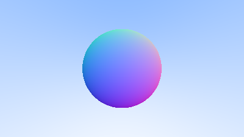

## Shading with Surface Normals

First, let’s get ourselves a surface normal so we can shade. This is a vector that is perpendicular to the surface at the point of intersection.

We have a key design decision to make for normal vectors in our code: whether normal vectors will have an arbitrary length, or will be normalized to unit length.

It is tempting to skip the expensive square root operation involved in normalizing the vector, in case it's not needed. In practice, however, there are three important observations. First, if a unit-length normal vector is *ever* required, then you might as well do it up front once, instead of over and over again “just in case” for every location where unit-length is required. Second, we *do* require unit-length normal vectors in several places. Third, if you require normal vectors to be unit length, then you can often efficiently generate that vector with an understanding of the specific geometry class, in its constructor, or in the `hit()` function. For example, sphere normals can be made unit length simply by dividing by the sphere radius, avoiding the square root entirely.

Given all of this, we will adopt the policy that all normal vectors will be of unit length.

For a sphere, the outward normal is in the direction of the hit point minus the center:


**Figure 6:** *Sphere surface-normal geometry*

<br>

On the earth, this means that the vector from the earth’s center to you points straight up. Let’s throw that into the code now, and shade it. We don’t have any lights or anything yet, so let’s just visualize the normals with a color map. A common trick used for visualizing normals (because it’s easy and somewhat intuitive to assume \\( \mathbf{n} \\) is a unit length vector — so each component is between \\( −1 \\) and \\( 1 \\)) is to map each component to the interval from \\( 0 \\) to \\( 1 \\), and then map \\( (x, y, z) \\) to \\( (red, green, blue) \\). For the normal, we need the hit point, not just whether we hit or not (which is all we're calculating at the moment). We only have one sphere in the scene, and it's directly in front of the camera, so we won't worry about negative values of \\( t \\) yet. We'll just assume the closest hit point (smallest \\( t \\)) is the one that we want. These changes in the code let us compute and visualize \\( \mathbf{n} \\):

```rust-diff,norun,noplayground
{{ #git diff -U999 -h 2cf21871a39a309bce0edfb75464389bba9782f4 47441cbbe4cb464b6f29e82801d47aba101092f2 src/main.rs::40 }}
```

**Listing 12:** [[main.rs](https://github.com/goldnor/code/blob/47441cbbe4cb464b6f29e82801d47aba101092f2/src/main.rs)] *Rendering surface normals on a sphere*

<br>

And that yields this picture:



**Image 4:** A sphere colored according to its normal vectors

<br>
