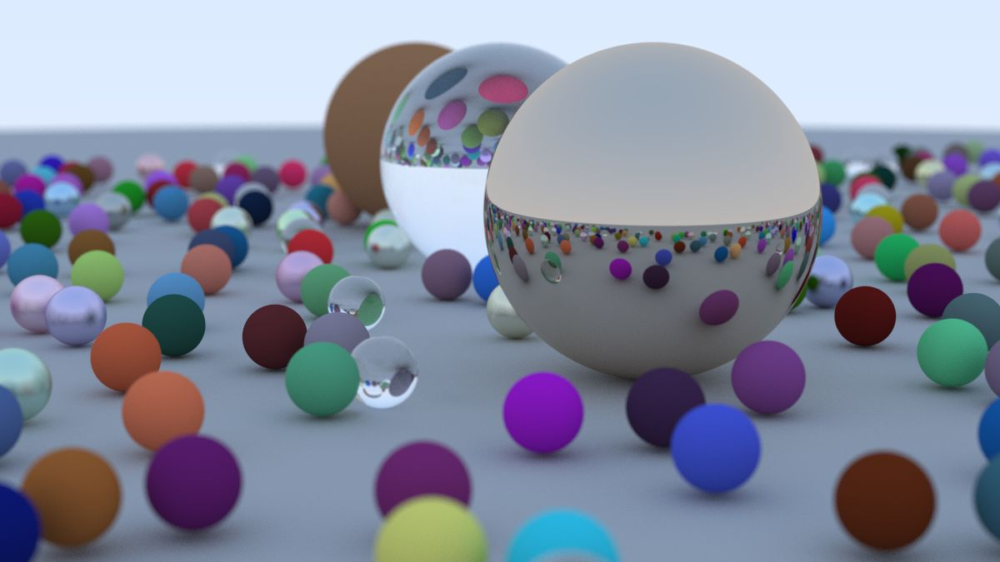

## A Final Render

Let’s make the image on the cover of this book — lots of random spheres.

```rust-diff,norun,noplayground
{{ #git diff -U999 -h f6173c36dab520541cdac68d8f9c40c24ca7b606 47aa675e5107a97fb7cfcb10499db9b843e3d300 src/main.rs:14: }}
```

**Listing 88:** [[main.rs]()] *Final scene*

<br>

(Note that the code above differs slightly from the project sample code: the `samples_per_pixel` is set to 500 above for a high-quality image that will take quite a while to render. The project source code uses a value of 10 in the interest of reasonable run times while developing and validating.)

This gives:



**Image 23:** *Final scene*

<br>

An interesting thing you might note is the glass balls don’t really have shadows which makes them look like they are floating. This is not a bug — you don’t see glass balls much in real life, where they also look a bit strange, and indeed seem to float on cloudy days. A point on the big sphere under a glass ball still has lots of light hitting it because the sky is re-ordered rather than blocked.
